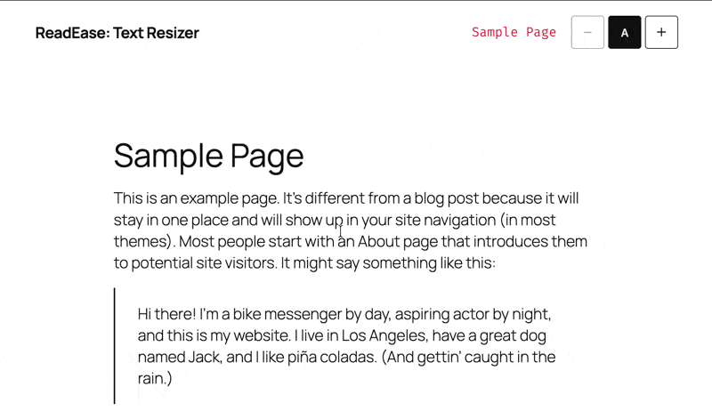
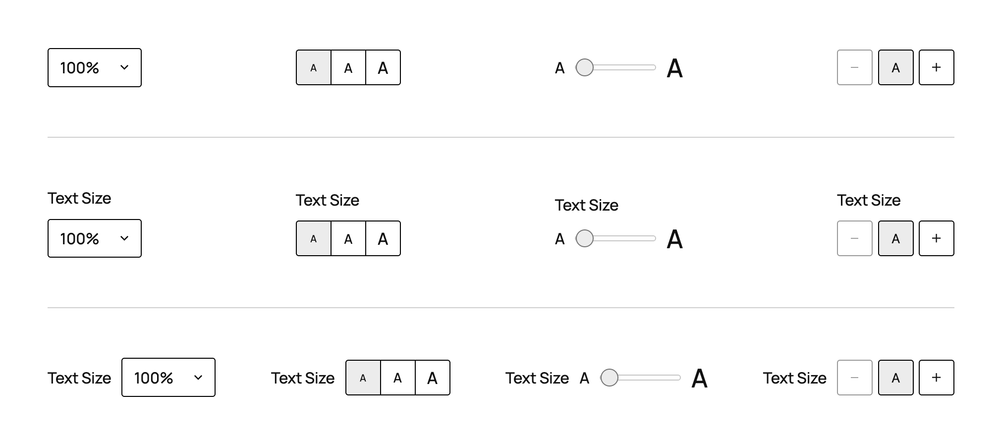

# ReadEase: Text Resizer

A Gutenberg block that lets site visitors resize text for improved readability and accessibility.

> **PluginJam Hackathon Entry** - This plugin was developed as part of the [PluginJam](https://pluginjam.com/) hackathon, created by [Nik McLaughlin](https://nikmclaughlin.com/), with the theme "Growth". ReadEase embodies growth in a literal, interactive way - visitors can grow the text on your site to meet their accessibility needs.

## Features

- **Multiple control styles** - Dropdown, buttons, slider, or minimal icons
- **Customizable label** - Position label on top, side, or hide it completely
- **Flexible scale settings** - Configure min/max scale (1.0x to 1.5x) and size steps (2-5)
- **Scale scope options** - Apply to full page or exclude template parts (header/footer)
- **Custom CSS selector** - Target specific elements with advanced selector option
- **Mobile-only mode** - Optionally show controls only on mobile/tablet devices
- **Persistent preferences** - Saves user choice via localStorage with cross-tab sync
- **Smooth transitions** - CSS-based scaling with reduced motion support
- **Fully accessible** - Keyboard navigable with proper ARIA labels
- **Block theme support** - Native color, spacing, and alignment controls
- **Theme customization** - CSS custom properties for easy style overrides



## Requirements

- WordPress 6.4+
- PHP 7.4+
- Block theme (e.g., Twenty Twenty-Five)

## Installation

1. Clone or download to `wp-content/plugins/readease`
2. Run `npm install && composer install`
3. Run `npm run build`
4. Activate the plugin in WordPress
5. Add the block to any template using the Site Editor

## Usage

### Control Styles

| Style | Description |
|-------|-------------|
| Dropdown | Select menu with percentage options (100%, 125%, 150%) |
| Buttons | Row of "A" buttons in increasing sizes |
| Slider | Range input with min/max "A" labels |
| Icons | Minimal +/A/- button group |

### Block Settings

**Display Settings:**

| Setting | Options | Default |
|---------|---------|---------|
| Control Style | dropdown, buttons, slider, icons | dropdown |
| Label Position | top, side, hidden | side |
| Label Text | Any string | "Text Size" |
| Mobile Only | true/false | false |

**Scale Settings:**

| Setting | Range | Default |
|---------|-------|---------|
| Scale Scope | full-page, exclude-template | exclude-template |
| Size Steps | 2-5 | 3 |
| Minimum Scale | 1.0-1.2 | 1.0 |
| Maximum Scale | 1.1-1.5 | 1.5 |

**Advanced:**

| Setting | Description |
|---------|-------------|
| Target Selector | Custom CSS selector for precise element targeting |



### Block Supports

The block includes native WordPress support for:

- **Colors** - Background and text color
- **Spacing** - Margin and padding
- **Alignment** - Left, center, right

## Theme Customization

ReadEase provides CSS custom properties that theme developers can override to match their design system.

### CSS Custom Properties

Add these to your theme's stylesheet to customize the block appearance:

```css
.wp-block-readease-text-resizer {
  /* Layout */
  --text-resizer-gap: 0.5em;               /* Space between label and controls */
  --text-resizer-controls-gap: 0.25em;     /* Space between control buttons */

  /* Colors */
  --text-resizer-button-bg: transparent;           /* Button background */
  --text-resizer-button-bg-hover: rgba(0, 0, 0, 0.05);  /* Hover state */
  --text-resizer-button-bg-active: rgba(0, 0, 0, 0.075); /* Active/selected state */
  --text-resizer-border-color: rgba(0, 0, 0, 1);   /* Border color */
  --text-resizer-focus-color: rgba(0, 0, 0, 0.5);  /* Focus outline color */
  --text-resizer-track-bg: #fff;                   /* Slider track background */
  --text-resizer-track-border: #c6c6c6;            /* Slider track border */
  --text-resizer-thumb-bg: #ECECEC;                /* Slider thumb background */
  --text-resizer-thumb-border-color: #757575;      /* Slider thumb border color */
  --text-resizer-thumb-border-width: 1px;          /* Slider thumb border width */

  /* Borders */
  --text-resizer-border-width: 1px;        /* Border thickness */
  --text-resizer-border-radius: 3px;       /* Corner rounding */

  /* Sizing */
  --text-resizer-min-height: 36px;         /* Minimum touch target size */
  --text-resizer-slider-width: 80px;       /* Slider width */
  --text-resizer-slider-height: 4px;       /* Slider track height */
  --text-resizer-thumb-size: 16px;         /* Slider thumb diameter */

  /* Transitions */
  --text-resizer-transition-duration: 0.15s;  /* Animation speed */
}
```

### Example: Pill-Shaped Buttons

```css
.wp-block-readease-text-resizer {
  --text-resizer-border-radius: 999px;
}
```

### Example: Dark Theme

```css
.wp-block-readease-text-resizer {
  --text-resizer-button-bg: rgba(255, 255, 255, 0.1);
  --text-resizer-button-bg-hover: rgba(255, 255, 255, 0.2);
  --text-resizer-track-bg: rgba(255, 255, 255, 0.2);
  --text-resizer-thumb-bg: #333;
}
```

### Example: Larger Touch Targets

```css
.wp-block-readease-text-resizer {
  --text-resizer-min-height: 52px;
  --text-resizer-gap: 1em;
}
```

## How It Works

1. Block renders a UI component based on the selected control style
2. JavaScript handles user interactions (clicks, slider changes)
3. Applies a CSS custom property to the target selector: `--text-resizer-scale: 1.2`
4. Site CSS uses this variable to scale text: `font-size: calc(1rem * var(--text-resizer-scale, 1))`
5. Preference is saved to localStorage key: `textResizerScale`
6. On page load, the saved preference is restored automatically

### Multiple Instances

If multiple Text Resizer blocks exist on a page:
- All instances share the same localStorage key
- All instances listen for storage events
- When one changes, others sync automatically

## Accessibility

- All controls are keyboard accessible
- ARIA labels on buttons: "Decrease text size", "Reset text size", "Increase text size"
- `aria-pressed` indicates the active state
- Respects `prefers-reduced-motion` for transitions
- Visible focus states on all interactive elements
- Minimum touch target size of 44px

## Development

```bash
# Install dependencies
npm install
composer install

# Start development build with watch
npm start

# Build for production
npm run build

# Lint code
npm run lint

# Format code
npm run format

# Individual linters
npm run lint:js
npm run lint:css
npm run lint:php
```

### File Structure

```
readease/
├── text-resizer.php           # Plugin bootstrap
├── package.json               # Node dependencies
├── composer.json              # PHP dependencies
├── src/
│   ├── block/                 # Block source files
│   │   ├── block.json         # Block metadata
│   │   ├── index.js           # Block registration
│   │   ├── edit.js            # Editor component
│   │   ├── view.js            # Frontend script
│   │   ├── render.php         # Server-side render
│   │   └── editor.scss        # Editor styles
│   ├── styles/                # Stylesheet partials
│   │   ├── _variables.scss    # CSS custom properties
│   │   ├── _base.scss         # Container and label
│   │   ├── _buttons.scss      # Buttons control style
│   │   ├── _slider.scss       # Slider control style
│   │   ├── _dropdown.scss     # Dropdown control style
│   │   ├── _icons.scss        # Icons control style
│   │   └── _utilities.scss    # Reduced motion, a11y
│   └── style.scss             # Main stylesheet entry
├── build/                     # Compiled assets (gitignored)
└── docs/                      # Additional documentation
```

## Browser Support

- Chrome (latest)
- Firefox (latest)
- Safari (latest)
- Edge (latest)
- Mobile Safari (iOS)
- Chrome Mobile (Android)

## License

GPL-2.0-or-later
